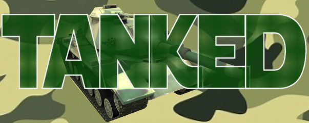

# Tanked: CS447 Final Project 2017

## Contributors

Samuel Riesterer

Sage Thongsrisubskul

Tyler Coy

Benjamin DeCamp

## How to Play
One player will host the game, while the others will join the host by entering the host's IP address. (Up to 4 players including the host.)

After the host has selected a map, and all players have selected their teams, the host starts the game to begin the match.

### Dealthmatch Mode
Players fire at each other and use various powerups to destroy tanks on other teams until only one team remains. Last team remianing wins.

### Highscore Mode
Explain game mode here.

### Controls
- W, S: Move the tank forwards or backwards
- A, D: Rotate the tank left or right
- Mouse: Aim the tank's turret
- Left Mouse Button: Fire turret

If the player has any powerups in their inventory, the following controls will utilize them:
- 1: Use health pack. (Restores some health)
- 2: Place down mine. (Directly below tank.)
- 3: Use speed boost pack. (Wears off over time.)
- 4: Use armor boost pack. (Wears off over time.)
- 5: Use invincibility pack. (Wears off over time.)
- 6: Use beer. (Temporary invincibility. Wears off over time, afterwards player experiences "hangover" which negatively effects armor and speed.)

### Powerups
6 Powerup items are availble:
- Health pack: Recovers a portion of player's health
- Mines: Damages enemy tanks when they drive over.
- Speed boost pack: Temporarily increase tank's speed.
- Armor boost pack: Temporarily increase tank's defense.
- Invincibility pack: No damage taken for a period of time.
- Beer: Explain beer...Please...

### Cheats
- F1: Gives player a health pack.
- F2: Gives player a mine.
- F3: Gives player a speed boost pack.
- F4: Gives player an armor boost pack.
- F5: Gives player an invincibility pack.
- F6: Gives player a beer.

## Low Bars
- [x] Main splash screen, setup game screen(s), help screen (explains the game and the controls), play game screen 
- [x] Playable map (larger than screen size) by 2 – 4 human players. 
- [x] Ability to select teams 
- [x] At least 3 different power ups that have a behavioral/visual impact 
- [x] Networking
- [x] One map
- [x] Different terrains and obstacles on map with collision detection
    - [ ] ability to destroy certain obstacles
- [x] One win condition: deathmatch
- [x] Tank has health meter and dies when health is 0 

## High Bars
- [ ] Different missile projectiles (with different animations)
- [ ] Different armor types for tanks
- [x] Powerups
- [x] Multiple maps to select from
- [x] Different win conditions (Dealthmatch, Highscore)
- [ ] Resizable screen?
- [ ] Save game feature?
- [ ] Non-playable enemy tanks with A.I. script
- [x] Mini-map feature (able to hide)

## Extra Features
- Sound effects
- Explosion animation
- Main menu music
- Limited missile fire rate
- Players can specify name
- Game lobby and in-game chat
- Pause Game

## License(s)
Tanked Source code: GPLv3

Assets:
- "https://github.com/bjorn/tiled/blob/master/LICENSE.GPL"
- "http://pngimg.com/download/1308",
- "http://www.fontspace.com/",
- "https://opengameart.org/",
- "http://www.reinerstilesets.de/lizenz/",
- "https://freesound.org/",
- "https://www.iconspng.com/",
- "https://modarchive.org/index.php?faq-licensing"

